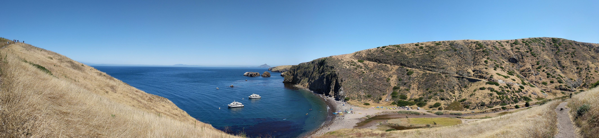

```{r setup, include=FALSE}
knitr::opts_chunk$set(echo = FALSE)
library(jpeg)
```

```{r}

```

Scorpion Anchorage, Santa Cruz Island, Channel Islands National Park

## Background & Interests

The natural world has given much to me personally and professionally. I was fortunate to be a kayak guide for several years in Channel Islands National Park, leading visitors through seacaves and interpreting the natural resources of Santa Cruz Island. Mixed with an existing interest in habitat restoration, exposure to Channel Islands National Park's incredible flora and fauna cultivated a desire to work in conservation. Having attended UC Santa Barbara for my undergraduate education, I was already aware of the Bren School and felt further education was a good path to pursue to enhance my skillsets and gain experience in the environmental field. This has allowed to my gain training and experience in data science and statistical analysis through coursework and academic projects. The blogs Data Science Portfolio tab in the navigation bar at the top of this page showcases some of this work.

Outdoor recreation, islands, and birding are my major interests outside of school. Prior to Bren I was able to spend to spend five months traveling New Zealand where I also gained experience as a kitchen assistant and housekeeping specialist (not exactly pertinent to a career using data science but interesting experiences). Being back in the Santa Barbara/Goleta area is made all the better by proximity to the Channel Islands and Devereux Slough, one of my favorite birding locations in Santa Barbara County. 


## Experience & Projects


At the Bren School I completed ESM 206 (Statistics & Data Analysis) and ESM 244 (Advanced Data Analysis). I became proficient in using the r programming language and working in the RStudio development environment. Additional coursework completed includes ESM 263 (Geographic Information Systems), where I became proficient in utilizing QGIS, a free and open-source geographic information system (GIS) application. Analysis and visualization of geospatial data is of particular interest to me.

Beyond considerable experience in the outdoor recreation field, I have worked in a variety of field work and management positions for habitat restoration and conservation-related projects. I have experience working with invasive species removal and native vegetation restoration at Coal Oil Point Reserve (COPR), the UCSB campus, the Santa Ynez River, the Santa Clara River, Vandenberg Air Force Base, Edwards Air Force Base, Los Padres National Forest, and Angeles National Forest. As a volunteer, I have participated in conservation projects on several Channel Islands.


